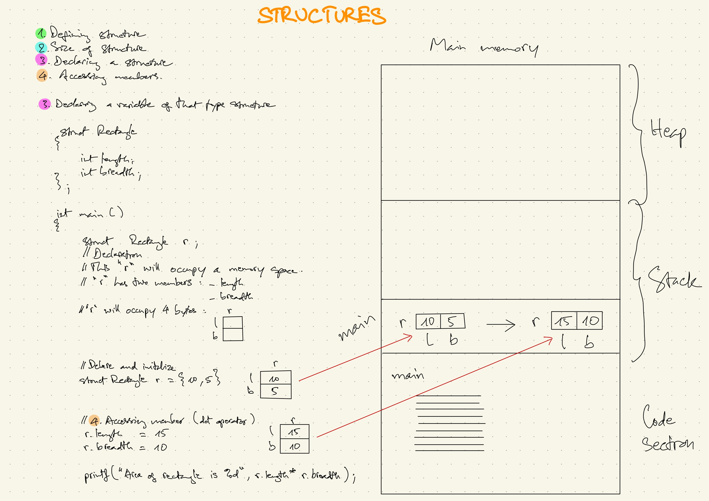
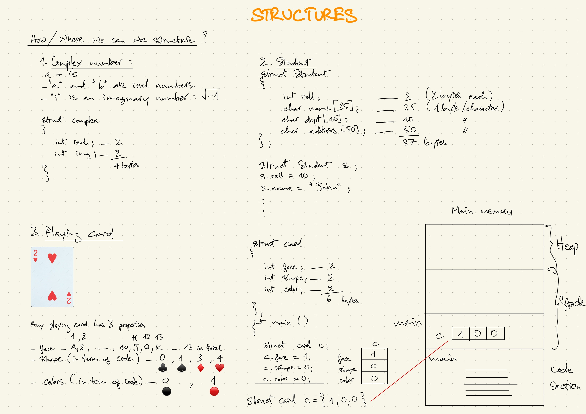

### Lesson Content

##### 1. Defining structure.
##### 2. Size of structure.
##### 3. Declaring a structure.
##### 4. Accessing members.

===========================

##### 1. Defining structure.

Example:
A rectangle has 2 properties:
- Length
- Breadth

```
struct Rectangle {
  int length;
  int breadth;
}
```
<br>

##### 2. Size of structure.

Assuming each property takes 2 bytes then the struct **Rectangle** is going to take 4 bytes in the main memory.

**The struct is not consuming any memory while at the definition stage.**

<br>

##### 3. Declaring a structure.

###### Step 1: defining the struct
```
struct Rectangle {
  int length;
  int breadth;
};

```

###### Step 2: declaring the struct

```
int main ()
{
  // declaring the struct
  struct Rectangle r;
}
```

##### Full code

```
struct Rectangle {
  int length;
  int breadth;
};
int main ()
{
  // declaring the struct
  struct Rectangle r;
}
```
<br>

##### Explain:
- r has two members:
  - length
  - breadth
- this struct 'r' will now occupy 4 bytes in the memory space.

<br>

###### Note:
length and breadth is consuming space in the main memory yet they have not been assigned any value.

<br>

###### Declare and initialize

```
struct Rectangle r = {10, 5}

// the equivalent of using the dot operator will be
// r.length = 10;
// r.breadth = 5;
```

##### Explain
10 and 5 are the values that have been assigned to length and breadth of the structure "r"

<br>

##### Full code to print out the result of struct r

```
struct Rectangle {
  int length;
  int breadth;
};

int main()
{
  struct Rectangle r = {10, 5};
  printf("%d", r.length*r.breadth); // 50 = 10 * 5

  return 0;
}
```

<br>

##### 4. Accessing members.

If we want to replace the current values of length and breadth with a new value then we can use the dot operator (picture: structure_02)

```
int main()
{
  struct Rectangle r = {10, 5};

  r.length = 15;
  r.breadth = 10;
  // accessing the struct members using dot operator
  // the old values of length and breadth in the main memory
  // have now been replaced with the new values

  printf("%d", r.length*r.breadth); // 150 = 15 * 10

  return 0;
}
```
structure_02


<br>

##### How and where we can use structure?
###### 1. Complex number

```
a + ib
```
- "a" and "b" are real numbers.
- "i" is an imaginary number: &#x221A;-1

###### Purpose of complex number
.....
.....
.....
.....

```
struct complex {
  int real; // real numbers
  int img; // imaginary number
}
```
A complex number will consume about 4 bytes in the memory
- int real - 2 bytes
- int img - 2 bytes

<br>

###### 2. Student
```
struct Student
{
  int roll;
  char name[25];
  char dept[10];
  char address[50];
};

struct Student s {
  s.roll = 10;
  s.name = "John";
  .
  .
  .
}
```

<br>

###### 3. Playing card

Any playing card has 3 properties (picture)
- Face: A, 2, 3,..., 10, J, Q, K - 13 cards in total
- Shape (in term of code): 0 (&hearts;), 1 (&diams;), 2 (&spades;), 3 (&clubs;)
- Color (in term of code): 0 (black), 1 (red)



##### Code

```
struct card {
  int face;
  int shape;
  int color;
};

int main (
  struct card c;
  c.face = 1;
  c.shape = 0;
  c.color = 0;
)
```

Assuming each member of the struct **card** takes 2 bytes, each card of the card deck will take 6 bytes in the memory.

<br>

In order to get 52 cards of the whole deck we will need to define a new struct variable

##### Code

```
struct card {
  int face;
  int shape;
  int color;
};

int main () {
  struct card deck[52];

  // defining new struct variable and initializing the cards
  struct card deck[52] = {
    {1,0,0}, // Ace of clubs in black color
    {1,1,0}, // Ace of spades in black color
    {2,0,0}, // Face "2" of clubs in black color
    {2,1,0}, // Face "2" of spades in black color
    .
    .
    .
  }

  // Accessing the card individually
  printf("%d", deck[0].face);
  printf("%d", deck[0].shape);
  .
  .
  .
};
```

The whole deck of card will take about 312 bytes (6 * 52) in the memory.