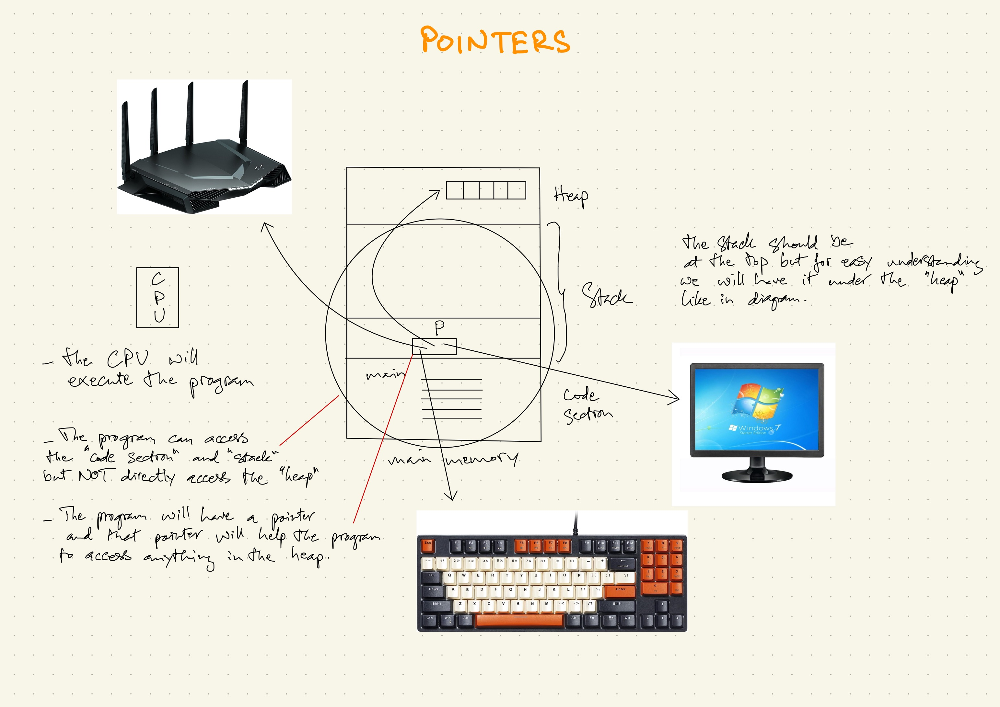
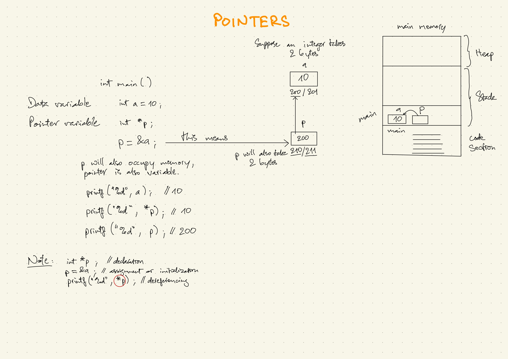
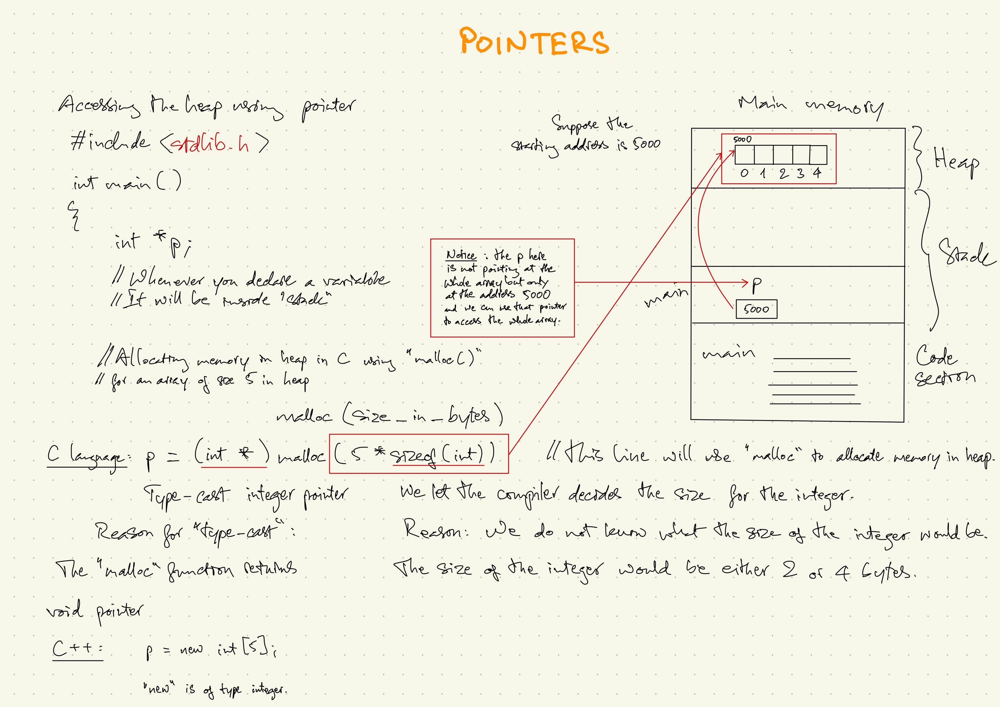

### Lesson Content
#### 1. Why pointer
#### 2. Declaration
#### 3. Initialization
#### 4. Dereferencing
#### 5. Dynamic allocation

==================

#### Overview of the main memory:
- The main memory consists of 3 sections:
    - code section
    - stack
    - heap
- The program can *directly* access the *code section* and *stack*.
- The program will *NOT directly* access the *heap*, therefore, *heap* is outside the program.
- The program needs the *pointer* to access the *heap* (Reason 1).
<br>

(Picture: pointers_01)<br>


#### 1. Why pointer
- Definition: Pointer is an address variable is meant for storing address of data, not the data itself.
- There are two types of variables
    - data variable: normal variable
    - address variable: pointer
- Usage (refer to picture "pointers_01")
    - Accessing heap.
    - Pointer is useful for accessing resources that are outside of the program (major usage)
        - files from a hard drive, the hard drive out of the program. The pointer with the correct file type of that file will be able to access the file.
        - keyboard, monitor (input, output devices).
        - internet, network connection.
    - Pointers are used for parameter passing.


**Question:** Why do you need to access data *indirectly*?
**Answer:** The program cannot directly access anything outside of itself (e.g. heap, keyboard, monitor,...). In order to access those things, the program needs to access them *indirectly* by using the pointer.
<br>

Code

```
int main () {
  int a = 0;
	int *p;
	p = &a;
}
```
<br>

#### 2. Declaration
```
int *p;
```
<br>

#### 3. Initialization
```
p = &a;
```
<br>

#### 4. Dereferencing
```
printf("%d", *p); // p is dereferenced
```
<br>

Variable size: Suppose an integer takes 2 bytes
- variable "a" takes 2 bytes which are the memory addresses 200 and 201.
- "p" is a pointer, which is also a variable, therefore "p" will take 2 bytes as well (assumably the memory addresses 210 and 211).
<br>

(Picture: pointers_02)<br>

<br>

#### Accessing the heap using pointer
<br>

<br>

##### Example: Create an array of size 5 in the heap

##### Code
```
#include <stdlib.h>

int main () {
	int *p;

	p = (int *)malloc(5 * sizeof(int))
}
```
<br>

##### Allocating memory in heap in C language use "malloc()"

```
p = (int *)malloc(5 * sizeof(int))
```
<br>

##### Explanation:

###### 1. Declare a variable
```
int *p;
```
Whenever you declare a variable, it will be inside "stack"
<br>

###### 2. Allocating memory in heap
```
(int *)malloc(5 * sizeof(int))
```
From right to left
```
sizeof(int)
```
- We let the compiler decides the size of the integer.
Reason: We do not know what the size of the integer would be. It would be either 2 or 4 bytes depending on the compiler (computer).
```
5 * sizeof(int)
```
- an array of size 5
```
malloc(5 * sizeof(int))
```
- Use *malloc()* to create an array of size 5.
```
p = (int *)malloc(5 * sizeof(int))
```
-  (int *) is used for <a href="https://www.geeksforgeeks.org/c-typecasting/">type-cast</a> integer pointer
Reason: The *malloc()* function returns void pointer.
<br>

**Note:**
- "p" is a pointer variable which will point to the starting address (the first element) of the array of size 5 in the heap.
- Assuming that the first element of the array has the address of "5000" then that will also be the value that is stored in pointer variable "p".
- While "p" is NOT pointing at the entire array yet we can use the pointer to access the entire array.