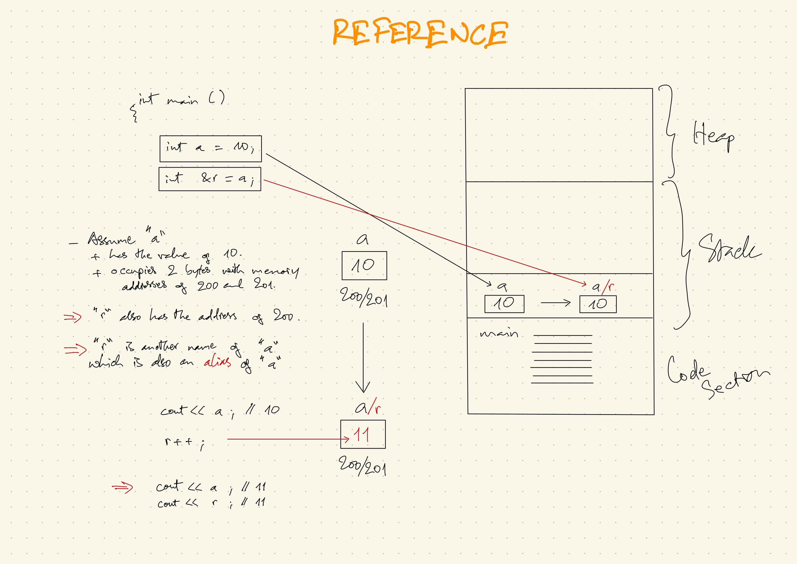

### LESSON CONTENT
#### 1. How to declare a reference
#### 2. How to initialize a reference

=========================



#### Preview
Data variable

```
int a = 10;
```

Pointer variable

```
int *a;
```

#### 1. How to declare a reference

```
int &r;
```

#### 2. How to initialize a reference

```
int &r = a;
```

### Full code

As always we can declare and initialize a variable all with one line of code.
```
int a = 10;
int &r = a;
```
- **Explanation:**
    - Variable "a" is assigned to reference variable "r".
    - When you have a reference variable "r" that is referring to variable "a" this means the variable "a" in the stack is also called as "r" (picture: reference.JPG)

**Now you have two names for the same value in the memory.**

Assuming that variable "a" is occupying 2 bytes in the memory space with the memory addresses of 200 and 201, the value stored in that memory cell of the variable "a" is 10 "r" will also have the base address of 200. (picture: reference.JPG).

<br>

- The relationship between "a" and "r"

    ```
    cout << a
    ```
    Output: 10
    ```
    r++;
    ```
    Output: 11 for both "a" and "r".<br>
    Reason: "a" and "r" now have the same value because "r" is the reference of "a".
    <br>
    So you will get the same value of 11 for these two codes.

    ```
    cout << r;
    cout << a;
    ```
    Output: 11

<br>

**Conclusion:** Reference is nothing but another name to a variable.<br>
"a" is the actual name of the variable and the memory address, "r" is an alias which is just another name of "a".
<br>
- **Question:** Why do you want another name to the same variable?<br>
- **Answer:**
  - This is useful in parameter passing.
  - This is a very useful feature of C++ for writing small functions, we use references instead of pointers.

**Note:** This example program is just a simple demonstration for using reference. There is actually no need for the use of "reference" in this program.