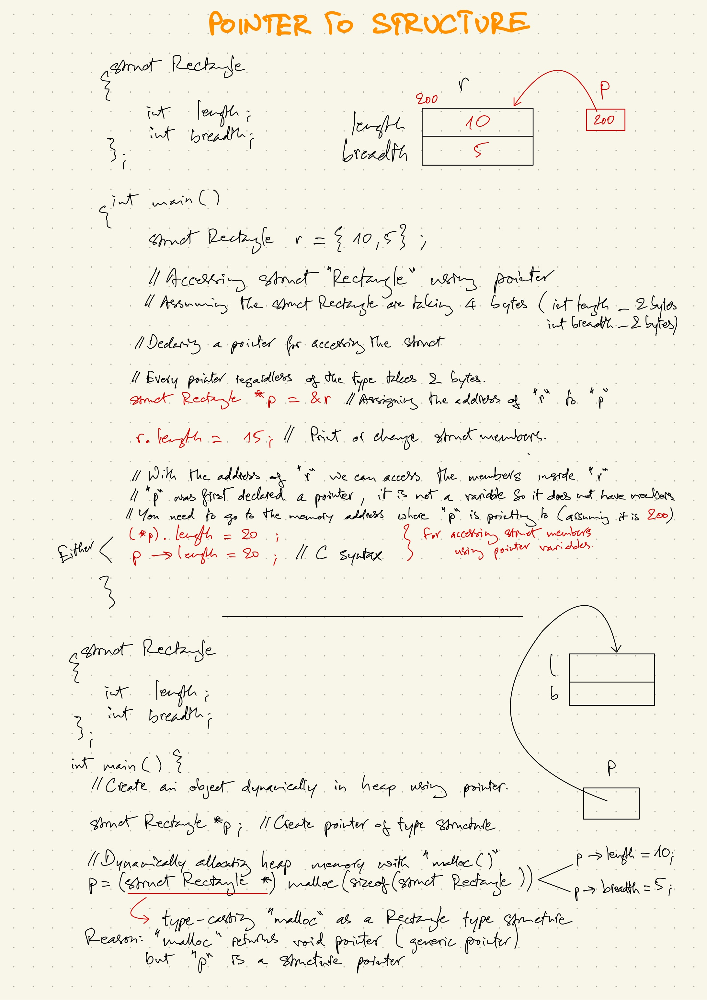

### LESSON CONTENT - POINTER TO STRUCTURE
#### 1. Accessing struct members with pointer variable
#### 2. Dynamically allocating struct in heap

==========================



#### 1. Accessing struct members with pointer variable

Given this struct
```
struct Rectangle {
    int length;
    int breadth;
};
```
Declaring struct "r" and initializing values for struct members "length" and "breadth" in the main program
```
int main () {
    struct Rectangle r = {10,5};
}
```
Say if you want to change the value of the struct member, you can do that with the "dot" operator
```
r.length = 15;
```
- Accessing struct "Rectangle" using pointer
    - Step 1: Declare a struct pointer "p"

        ```
        struct Rectangle *p;
        ```
    - Step 2: Assigning the address of struct "r" to struct pointer "p"

        ```
        struct Rectangle *p = &r;
        ```
    - Step 3: Print out the value of length from struct Rectangle by using the struct pointer "p"

        ```
        (*p).length
        ```
    - Full code

        ```
        struct Rectangle *p = &r;
        cout << (*p).length << endl;
        ```
    **Note:** In C language, an alternative of ```(*p).length```
    is ```p->length```. Either will work just fine.
- Example: Changing value for struct member using arrow syntax

    ```
    p->length = 20;
    ```
    Printing out that line will give you the output as follow
    ```
    p->length = 20;
    cout << p->length << endl;
    ```
    Output:
    ```
    20
    ```

#### 2. Dynamically allocating struct in heap
- Given the same struct as above

    ```
    struct Rectangle {
        int length;
        int breadth;
    };
    ```

- main program

    ```
    int main () {
        struct Rectangle *p;

        p = (struct Rectangle *)malloc(sizeof(struct Rectangle));
    }
    ```

- Code breakdown
    - Step 1: Create a struct pointer

        ```
        struct Rectangle *p;
        ```
    - Step 2: Dynamically allocating heap memory with malloc
        - Allocate the required space (bytes unit)<br>
            There are two options
            - If you want to decide that yourself:<br>
            2 members of "int" type which would require 4 bytes (assumption).
            - Let the compiler decides that

                ```
                sizeof(struct Rectangle)
                ```
        - Dynamically allocating using "malloc"

            ```
            malloc(sizeof(struct Rectangle))
            ```
        - Type-casting "malloc" as a Rectangle type structure

            ```
            p = (struct Rectangle *)malloc(sizeof(struct Rectangle));
            ```
            Reason for type-casting: "malloc" returns void pointer (generic pointer) but "p" is a structure pointer.
    - Step 3: Accessing and assigning value for struct members in the heap

        ```
        p->length = 10;
        p->breadth = 5;
        ```