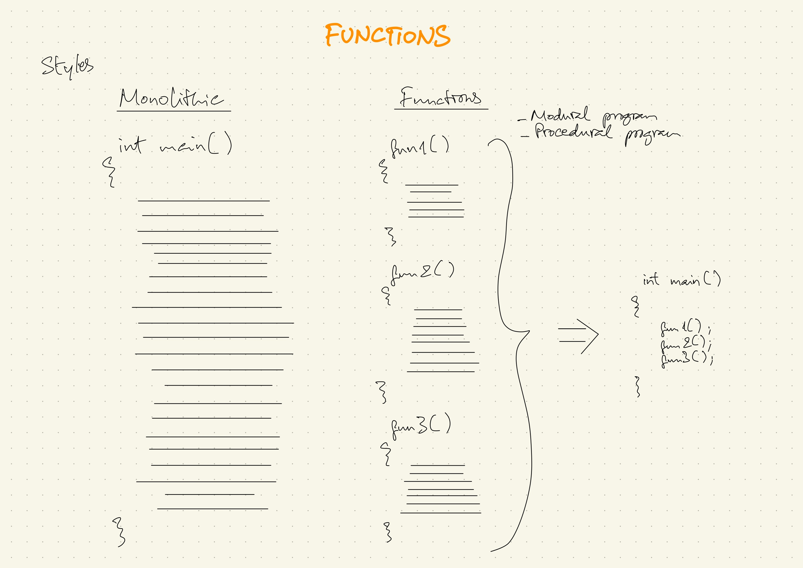
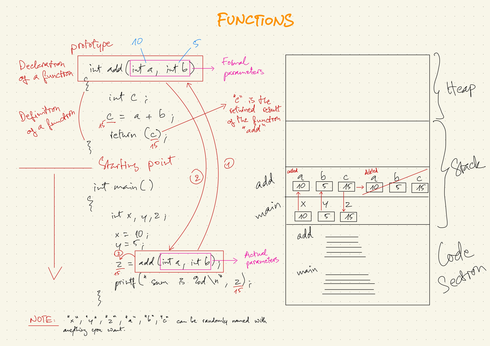

### LESSON CONTENT - FUNCTIONS
#### 1. What are functions
#### 2. Paramater passing
##### - Pass by Value (C language)
##### - Pass by Address (C language)
##### - Pass by Reference (C++ language)
==========================

- Programming styles
    - Monolithic: All functions inside one long big program. Only one individual programmer can work on the program.
    - Procedural (Modular): A long big program divided into smaller pieces of functions.
        - A group of programmers can develop a single program.
        - Team leader can integrate all the small functions inside the big program.
- Pros and cons
    - Monolithic:
        -  Cons:
            -  Redundant (duplication).
            -  No reusability.
    - Modular:
        - Pros:
            - Productivity
            - Reusability



#### 1. What are functions
- Function is a piece of code which performs a specific task.<br>

- Compare **structure** and **function**:<br>
    - **Structure** is a group of related data members.<br>
    - **Function** is a group of related instructions.

- Example:
    - Full code

        ```
        int add(int a, int b) {
            int c;
            c = a + b;
            return (c);
        }

        int main () {
            int x, y, z;
            
            x = 10;
            y = 5;
            
            z = add(x, y);
            printf("Sum is %d", z);
        }
        ```
    - Output:

        ```
        15
        ```
    - Code breakdown
        - Function "add"
    
            ```
            int add(int a, int b) {
                int c;
                c = a + b;
                return (c);
            }
            ```
        - Main program
        
            ```
            int main () {
                int x, y, z;
                
                x = 10;
                y = 5;
                
                z = add(x, y);
                printf("Sum is %d", z);
            }
            ```
        - Explanation:<br>
        The main function is the starting point of the program.
            - Step 1: Code in the main function will be executed first.<br>
                When the function "add" is called from the main function

                ```
                add(x, y);
                ```
                then the "add" function outside the main function will be executed.
    
                ```
                int add(int a, int b)
                ```
                **Note:** The parameters "x", "y", "a", "b" are just random names. They can be named anything.
            - Step 2: As the "add" function outside the main function is called, it will do the addition task of "a + b" and it will return "c" as the sum of the addition.

                ```
                c = a + b;
                return (c);
                ```
            - Step 3: As the separate "add" function finishes with the task, the progress continues in the main function.
            - Step 4: In the final step, the result returned from the "add" function outside the main function will be assigned to variable "z" of the main function. "z" is then printed out with the value of "15" by the main function.<br>
            **Note:** The value of "15" is the result from the addition between "a" and "b" in the function "add" which is assigned to variable "z" at the end.
        - Terminologies:
            - "add" function
                - Prototype / signature of a function
            
                    ```
                    int add(int a, int b)
                    ```
                    a *declaration* of a function.
                - The body of the "add" function
                
                    ```
                    int c;
                    c = a + b;
                    return (c);
                    ```
                    This is called the *definition* or elaboration of a function.
            - main function
                - Declaring variables

                    ```
                    int x, y, z;
                    ```
                - assigning values

                    ```
                    x = 10;
                    y = 5;
                    ```
                - function call
                
                    ```
                    add(x, y)
                    ```
                    "x", "y" are called *actual parameters* as you are passing those values to the function "add" outside the main function.
                    ```
                    int add (int a, int b);
                    ```
                    the function "add" is taking two parameters "a" and "b" which are called *formal parameters*.

    - What happened in the main memory?
        - Code section: *main* and *add* functions are created.
        - Stack section:
            - Step 1: In the *main* function,

                ```
                int x, y, z;
                    
                x = 10;
                y = 5;
                ```
                - variables "x", "y", "z" are created.
                - "x" and "y" are initialized with values "10", "5".
                - as the *add* function is called within the *main* function, "x" and "y" are passed to the separate *add* function as *actual parameters*

                    ```
                    z = add(x, y);
                    ```
            - Step 2: In the *add* function
                - variables "a", "b", "c" are created and are passed with the values "10", "5" from variables "x", "y" from the *main* function
                - with "15" being returned from the addition of "a" and "b". It is assigned to "c" and "c" holds the value of "15" inside the stack.
            - Step 3: Back in the *main* function
            As the result value "15" of the sum of "a" and "b" are assigned (copied) to "z"

                ```
                z = add(x, y);
                ```
            That value is copied from "c" to "z" in the Stack.
            - Step 4: As the *add* function finishes with the task, everything about the function terminates, its activation record in the Stack memory is deleted.
                
        **Note:** *main* and *add* functions cannot access the variables of each other's.<br>
        => function *main* does not have access to variable "a", "b", "c" and function *add* does not have access to variable "x", "y", "z".